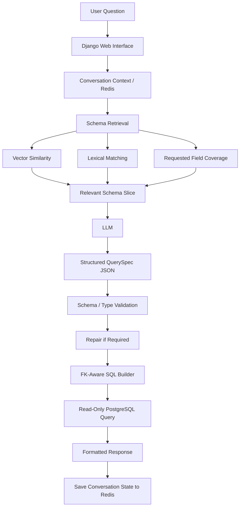

# Schema-Aware SQL RAG Assistant

A schema-aware, read-only AI assistant that allows users to query structured PostgreSQL databases using natural language.

Instead of allowing an LLM to generate and execute unrestricted SQL, the system retrieves the most relevant portion of the database schema using RAG, generates a structured `QuerySpec`, validates and repairs that specification against the real schema, converts it into guarded SQL, executes the query in read-only mode, and returns a formatted response.

---

## Overview

Business users often need information stored across complex relational databases without knowing SQL or understanding the underlying schema.

Traditional text-to-SQL systems can introduce problems such as:

- Hallucinated tables or columns
- Invalid joins
- Incorrect assumptions about schema structure
- Unsafe or unrestricted SQL generation
- Loss of conversational context

This project takes a more controlled approach by combining:

- Schema-aware Retrieval-Augmented Generation
- Structured LLM query planning
- Schema and type validation
- Foreign-key-aware SQL generation
- Read-only execution
- Conversational memory
- Clarification and topic-drift handling

---

## Key Features

- Natural-language querying of PostgreSQL databases
- Schema-aware RAG using Qdrant
- Vector similarity, lexical matching and requested-field coverage
- Structured `QuerySpec` generation instead of unrestricted raw SQL
- Validation and repair against the live database schema
- Foreign-key-aware join construction
- Guarded read-only SQL execution
- Redis-backed conversation memory
- Clarification-state management
- Topic-drift detection
- Optional ambiguous-ID resolution
- Optional developer-approved intent mappings
- Optional LLM-based answer formatting

---

## Architecture



---

## Safety-Oriented Query Design

A key design decision in this project is that the LLM does **not directly produce SQL for unrestricted execution**.

Instead:

1. The relevant database schema is retrieved.
2. The LLM generates a structured `QuerySpec`.
3. The specification is checked against the real schema.
4. Types, fields and relationships are validated.
5. Invalid elements can be repaired before execution.
6. SQL is constructed by the backend.
7. The resulting query is executed through the read-only workflow.

This reduces reliance on unconstrained LLM-generated SQL and keeps database access grounded in known schema information.

---

## Tech Stack

| Area | Technology |
|---|---|
| Backend | Python, Django |
| Database | PostgreSQL |
| Vector Database | Qdrant |
| Conversation State | Redis |
| Embeddings | SentenceTransformers |
| LLM Integration | Hugging Face Router |
| Local Services | Docker Compose |
| AI Pattern | Schema-Aware RAG / Text-to-SQL |

---

# End-to-End Request Flow

## 1. User Interface

`chat.html`

The web UI sends a POST request containing:

```json
{
  "message": "user question",
  "conversation_id": "optional conversation identifier"
}
```

Requests are sent to the Django `chat_api` endpoint with CSRF protection.

---

## 2. Django View

`chatbot_views.py`

The view validates the request and calls:

```python
answer_user_question(
    request.user,
    message,
    session_key=request.session.session_key
)
```

The API then returns:

```json
{
  "reply": "...",
  "conversation_id": "..."
}
```

---

## 3. Conversation State

`chatbot_memory.py`

Redis stores:

- Message history
- Pending clarification state
- Per-user and per-session context

The memory layer also manages:

- TTL
- Maximum history length
- Session continuity

---

## 4. Topic and History Gating

Before generating a new query, the engine checks whether previous conversation history is still relevant.

This helps prevent an earlier topic from incorrectly influencing a new request.

The behavior is controlled through values such as:

```env
HISTORY_MAX_FOR_LLM=12
TOPIC_JACCARD_THRESHOLD=0.18
```

---

## 5. Optional ID Resolution

The engine can optionally probe the database when a user provides an ambiguous identifier.

This behavior is controlled by:

```env
ENABLE_ID_RESOLVER=1
```

---

## 6. Schema Retrieval

`chatbot_retrieval.py`

The retrieval layer selects the most relevant portion of the database schema.

It combines:

- SentenceTransformer embeddings
- Qdrant vector similarity
- Lexical matching
- Requested-field coverage
- Foreign-key relationships

The system can also add bridge tables when necessary so valid joins remain possible between relevant entities.

---

## 7. QuerySpec Generation

`llm_gateway.py`

The selected schema context is sent to the configured LLM.

Instead of generating raw SQL, the model produces a structured `QuerySpec` JSON representation.

The gateway also supports:

- Requested-field extraction
- QuerySpec generation
- Optional final-answer formatting

---

## 8. Schema Validation and Repair

`chatbot_schema.py`

The generated QuerySpec is checked against the actual database schema.

Validation includes:

- Table existence
- Column existence
- Column types
- Foreign-key relationships
- Join compatibility

The system can repair incompatible or invalid elements before SQL construction.

---

## 9. Safe SQL Construction

`chatbot_sql.py`

The validated QuerySpec is converted into SQL by backend logic.

The SQL layer:

- Uses known schema metadata
- Applies quoting and guardrails
- Uses known foreign-key relationships
- Builds valid joins
- Executes through the read-only workflow

---

## 10. Response Generation

The query result is returned to the user in a formatted response.

Optional LLM answer formatting can be enabled with:

```env
ANSWER_WITH_LLM=1
```

Otherwise, the backend formats the result directly.

---

## 11. Conversation Update

The completed interaction is saved back into Redis so the next request can use relevant conversational context.

---

# Project Structure

## UI and Django Views

### `chat.html`

Frontend chat interface.

Posts to:

```django

```

using the `X-CSRFToken` header.

### `chatbot_views.py`

Contains:

- `chat_page`
- `chat_api`

`chat_page` serves the UI and sets the CSRF cookie.

`chat_api` receives user messages and passes them to the chatbot engine.

---

## Orchestration

### `chatbot_engine.py`

Main orchestration layer.

Primary function:

```python
answer_user_question()
```

It coordinates:

- Conversation history
- Topic-drift detection
- Clarification handling
- Optional ID resolution
- Schema retrieval
- LLM QuerySpec generation
- Schema validation
- Type-aware repair
- SQL generation
- SQL execution
- Response formatting
- Memory updates

---

## Memory

### `chatbot_memory.py`

Stores conversation state in Redis.

Includes:

- User/session history
- Clarification state
- TTL handling
- History trimming

---

## Schema Management

### `chatbot_schema.py`

Responsible for database schema introspection.

It retrieves:

- Tables
- Columns
- Data types
- Foreign keys

It also:

- Builds schema chunks for embedding
- Provides cached foreign-key edges
- Provides type metadata for validation

---

### `chatbot_table_docs.py`

Loads human-readable table descriptions.

These descriptions help improve:

- Retrieval quality
- Schema interpretation
- LLM context

The engine expects:

```text
BASE_DIR/app/resources/table_descriptions.txt
```

---

# Retrieval and RAG

## `chatbot_retrieval.py`

Uses SentenceTransformers and Qdrant to retrieve relevant schema information.

Retrieval combines:

- Vector similarity
- Lexical matching
- Requested-field coverage

The requested fields can be extracted through the LLM before schema retrieval.

The retrieval layer also uses foreign-key paths to identify bridge tables when required.

---

## Intent Collection

The system optionally supports developer-approved intent mappings stored in Qdrant.

These can improve routing for known or previously reviewed requests.

---

# QuerySpec to SQL

## `chatbot_sql.py`

Converts validated QuerySpec objects into SQL.

Responsibilities include:

- Safe quoting
- Join construction
- Foreign-key-aware relationships
- Query guardrails
- Read-only execution

---

# Qdrant Utilities

## `reindex_schema.py`

Django management command used to embed and index the current database schema into Qdrant.

Run:

```bash
python manage.py reindex_schema
```

The command uses stable UUID keys and can be safely re-run.

Run it whenever the database schema changes.

---

## `publish_intents.py`

Publishes approved intent mappings from `ChatbotReviewItem`.

Example:

```bash
python manage.py publish_intents --limit 100
```

The command:

1. Finds approved clarification items
2. Upserts them into the Qdrant intent collection
3. Marks them as published to avoid duplication

---

## `chatbot_qdrant.py`

Utility for intent upserts.

This overlaps with some functionality inside the retrieval layer and is retained as a smaller helper.

---

# LLM Gateway

## `llm_gateway.py`

Handles communication with the configured LLM provider.

Default provider:

**Hugging Face Router**

Responsibilities include:

- QuerySpec generation
- Requested-field extraction
- Optional answer formatting

The gateway also maintains anchor date/time values using the configured Dubai timezone.

---

# Required Services

The application requires:

- PostgreSQL
- Redis
- Qdrant
- LLM access

PostgreSQL contains the structured data being queried.

Redis stores conversation state.

Qdrant stores schema embeddings and optional intent mappings.

The LLM generates structured query specifications and can optionally format answers.

---

# Environment Variables

Create a `.env` file in the project root or export the variables through your environment.

> Do not commit real API keys, credentials or production database passwords.

---

## Redis

```env
REDIS_URL=redis://localhost:6379/0
CHAT_TTL_SECONDS=86400
CHAT_MAX_HISTORY=30
```

---

## Qdrant

```env
QDRANT_URL=http://localhost:6333
QDRANT_API_KEY=
QDRANT_SCHEMA_COLLECTION=schema_collection
QDRANT_INTENT_COLLECTION=intent_collection
EMBEDDING_MODEL=sentence-transformers/all-MiniLM-L6-v2
EMBEDDING_DIM=384
```

---

## LLM

```env
LLM_PROVIDER=hf
HF_TOKEN=your_token_here
HF_BASE_URL=https://router.huggingface.co/v1
HF_MODEL=HuggingFaceTB/SmolLM3-3B:hf-inference
```

---

## Engine Configuration

```env
SCHEMA_RAG_MIN_SCORE=0.55
ENABLE_TABLE_PICKER=0
ENABLE_ID_RESOLVER=1
HISTORY_MAX_FOR_LLM=12
TOPIC_JACCARD_THRESHOLD=0.18
DEBUG_QUERY_SPEC=1
```

---

## LLM Gateway Configuration

```env
CHAT_HISTORY_MAX_FOR_LLM=12
ANSWER_WITH_LLM=0
LLM_TIMEOUT_SECONDS=60
LLM_RETRY_MAX=4
```

---

## Table Descriptions

Default path:

```text
BASE_DIR/app/resources/table_descriptions.txt
```

Optional override:

```env
TABLE_DESCRIPTIONS_PATH=/absolute/path/to/table_descriptions.txt
```

---

# Running Locally

## 1. Clone the Repository

```bash
git clone <repository-url>
cd schema-aware-sql-rag-assistant
```

---

## 2. Start Redis and Qdrant

The included Docker Compose configuration starts:

- Qdrant
- Redis

Run:

```bash
docker compose up -d
```

Verify:

```text
Qdrant: http://localhost:6333
Redis: localhost:6379
```

PostgreSQL is expected to be configured separately.

---

## 3. Create a Virtual Environment

```bash
python -m venv .venv
```

### Windows

```bash
.venv\Scripts\activate
```

### macOS / Linux

```bash
source .venv/bin/activate
```

---

## 4. Install Dependencies

```bash
pip install -r requirements.txt
```

Core dependencies include:

- Django
- Redis
- qdrant-client
- sentence-transformers
- requests
- python-dotenv

---

## 5. Configure PostgreSQL

Configure Django's `DATABASES` setting for the PostgreSQL database you want the assistant to query.

Then run:

```bash
python manage.py migrate
```

---

## 6. Optional Sample Data

If using the included Django fixture:

```bash
python manage.py loaddata data.json
```

Use sample or synthetic data when running the project publicly.

---

## 7. Add Table Descriptions

Create:

```text
<BASE_DIR>/app/resources/table_descriptions.txt
```

Add human-readable descriptions of the relevant tables.

---

## 8. Index the Database Schema

This step is required.

Run:

```bash
python manage.py reindex_schema
```

This creates the schema vector index used during retrieval.

Re-run the command whenever:

- Tables are added
- Columns are changed
- Migrations modify the schema

---

## 9. Create a User

The chat interface requires authentication.

Run:

```bash
python manage.py createsuperuser
```

---

## 10. Start Django

```bash
python manage.py runserver
```

Open:

```text
http://127.0.0.1:8000/chat/
```

---

# URL Configuration

The chat interface expects a URL named `chat_api`.

Example:

```python
from django.urls import path
from app.chatbot_views import chat_page, chat_api

urlpatterns = [
    path("chat/", chat_page, name="chat_page"),
    path("api/chat/", chat_api, name="chat_api"),
]
```

---

# Publishing Approved Intents

If `ChatbotReviewItem` is being used, approved clarification mappings can be published to Qdrant.

Run:

```bash
python manage.py publish_intents --limit 100
```

The command:

- Reads approved items
- Filters for clarification-type entries
- Upserts them into the Qdrant intent collection
- Marks successful entries as published

---

# Troubleshooting

## Qdrant Dimension Mismatch

If the embedding model or embedding dimension changes, the existing Qdrant collection may no longer match.

Either:

1. Delete and recreate the collection

or

2. Set:

```env
EMBEDDING_DIM=
```

to match the existing collection.

---

## Slow First Run

SentenceTransformer models may need to download and initialise during the first execution.

Subsequent runs should avoid this initial model-download overhead.

---

## Poor Schema Retrieval

If retrieval returns weak or irrelevant schema context:

1. Confirm Qdrant is running.
2. Confirm `python manage.py reindex_schema` completed successfully.
3. Verify the application can access database metadata.
4. Check table descriptions.
5. Review `SCHEMA_RAG_MIN_SCORE`.
6. Confirm the embedding model matches the indexed collection.

---

## Missing Table Descriptions

Verify this file exists:

```text
BASE_DIR/app/resources/table_descriptions.txt
```

or configure:

```env
TABLE_DESCRIPTIONS_PATH=
```

---

# Security Notes

This repository is intended to demonstrate a controlled approach to LLM-assisted database querying.

When adapting it to another environment:

- Use a database account with read-only permissions
- Never commit `.env` files
- Never commit API keys or database credentials
- Avoid publishing real customer or company data
- Use synthetic fixtures for public demonstrations
- Review persisted vector-store data before making it public
- Apply appropriate authentication and authorization for production deployments

---

# Current Limitations

The system still depends on the quality of:

- Database schema metadata
- Table descriptions
- Embedding retrieval
- LLM QuerySpec generation
- Schema relationships

Complex or ambiguous questions may still require clarification.

The project is designed to reduce unsafe or invalid generation, not to guarantee that every natural-language request can be translated into a correct database query.

---

# Future Improvements

Potential improvements include:

- Expanded automated evaluation of generated QuerySpecs
- More advanced clarification handling
- Improved retrieval ranking
- Additional LLM providers
- Better observability and tracing
- Automated schema-change detection and reindexing
- More detailed query auditing
- Improved user-facing result visualisation

---

## Project Goal

The goal of this project is to explore a safer and more structured alternative to unrestricted text-to-SQL generation by combining schema-aware retrieval, constrained LLM planning and deterministic backend validation before database execution.
